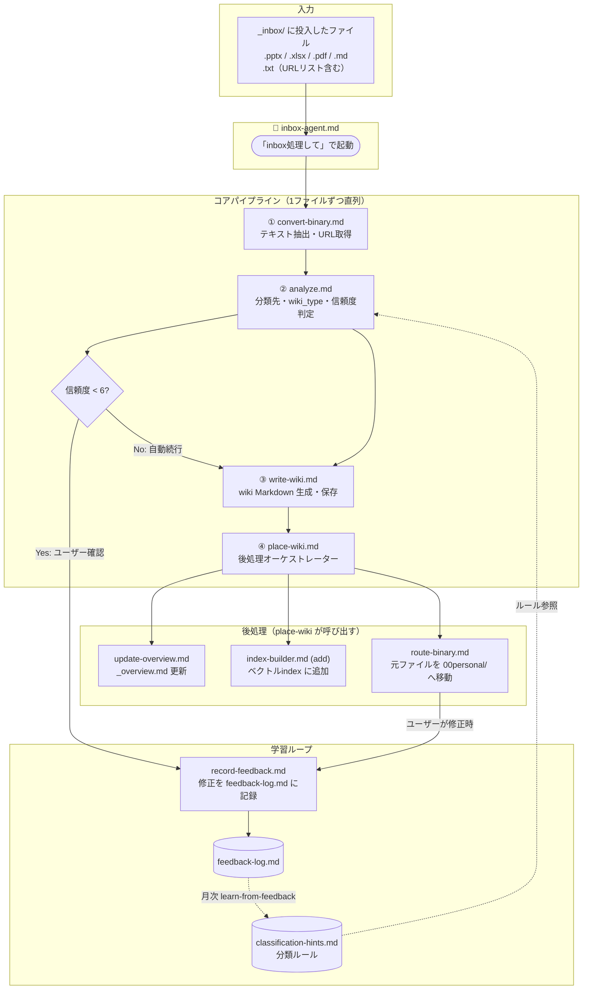
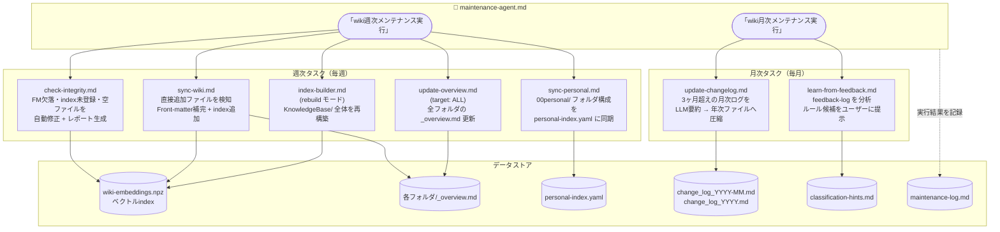
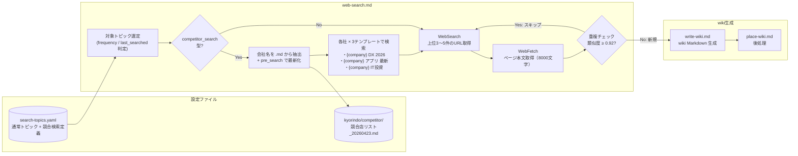

# wiki-agent アーキテクチャ概要

## システム全体像

```
👤 ユーザー
  ├── 「inbox処理して」    → inbox-agent.md
  └── 「メンテナンスして」 → maintenance-agent.md
```

---

## 関連図 1: inbox フロー（ファイル → wiki 化）



---

## 関連図 2: maintenance-agent フロー（定期メンテナンス）



---

## 関連図 3: web-search フロー



---

## スキル・エージェント機能一覧

### 🤖 エージェント（2本）

| ファイル | 起動方法 | 役割 |
|---------|---------|------|
| **inbox-agent.md** | 「inbox処理して」 | _inbox/ のファイルをwiki化するメインエージェント。コアパイプラインを直列実行 |
| **maintenance-agent.md** | 「wiki週次/月次メンテナンス実行」 | 定期メンテナンスを束ねるエージェント。週次5タスク・月次2タスクを順次実行 |

---

### 📦 一括処理スキル（batch フロー）

| ファイル | 起動方法 | 役割 |
|---------|---------|------|
| **batch-inbox.md** | 「03_CX推進/ をバッチ処理して」 | フォルダを指定して未処理ファイルを一括wiki化。processed-sources.yaml で重複防止・削除検出 |

---

### 📥 コアパイプライン（inbox フロー）

| # | ファイル | 入力 | 出力 | 機能概要 |
|---|---------|------|------|---------|
| 1 | **analyze.md** | ファイル内容 | 分類先・wiki_type・信頼度 | classification-hints → LLMスコアリング → ベクトル類似検索の3段階ハイブリッド分類 |
| 2 | **convert-binary.md** | _inbox/ のファイルパス | 抽出テキスト / URLリスト | .pptx/.xlsx/.pdf/.md/.txt/URLリストをMarkdownテキストに変換 |
| 3 | **write-wiki.md** | 分類結果 + テキスト | wiki .md ファイル | wiki_typeごとのテンプレートでFront-matter付きMarkdown生成・保存 |
| 4 | **place-wiki.md** | 保存済みwikiパス | — | 後処理オーケストレーター。_overview作成・changelog記録・index追加・00personal移動・processed-sources記録を連鎖実行 |

---

### ⚙️ 後処理スキル

| # | ファイル | 入力 | 出力 | 機能概要 |
|---|---------|------|------|---------|
| 5 | **route-binary.md** | 元ファイルパス | 00personal/ 移動済み | wiki_destinationとpersonal-index.yamlを照合し最適フォルダへ移動。ユーザー確認あり |
| 6 | **update-overview.md** | フォルダパス | _overview.md 更新 | フォルダ内の全.mdからFront-matterを集約し概要ページを自動更新（draft→LLM執筆/current→リスト更新）|
| 7 | **index-builder.md** | ファイルパス / モード | wiki-embeddings.npz | addモード（1件追加）/ rebuildモード（全件再構築）。削除検知・欠損除去も実施 |

---

### 🧠 学習・フィードバック

| # | ファイル | 入力 | 出力 | 機能概要 |
|---|---------|------|------|---------|
| 8 | **record-feedback.md** | 修正前後の分類先 | feedback-log.md に追記 | ユーザーが分類を修正したとき即時記録。100件超過で learn-from-feedback を推奨通知 |
| 9 | **learn-from-feedback.md** | feedback-log.md | classification-hints.md に追記 | 3回以上のパターンをLLMが分析しルール候補を生成。ユーザー承認後にルールを追記 |

---

### 🔧 メンテナンス専用スキル

| # | ファイル | 頻度 | 機能概要 |
|---|---------|------|---------|
| 10 | **sync-personal.md** | 週次 | 00personal/ の実フォルダとpersonal-index.yamlを全件比較し追加・削除・リネームを同期 |
| 11 | **sync-wiki.md** | 週次 | wiki-embeddings.npz未登録のファイルを検知。Front-matter補完＋index追加＋overview更新 |
| 12 | **check-integrity.md** | 週次 | FM欠落/index未登録を自動修正、空ファイル(2文字未満)を検出、削除済みソースファイルをスイープ。integrity-report.md に保存 |
| 13 | **update-changelog.md** | 月次 | 3ヶ月超えの月次ログをLLMが2〜4文に要約→年次ファイルへ集約→archive/に移動 |
| 14 | **web-search.md** | 週次/月次 | search-topics.yamlのトピックでWebSearch→WebFetch→重複チェック→wiki自動生成。競合17社×3テンプレート検索対応 |

---

### 📊 データストア一覧

| ファイル | 場所 | 用途 |
|---------|------|------|
| `wiki-embeddings.npz` | `_system/` | ベクトルindex（パス + embedding） |
| `classification-hints.md` | `_system/learning/` | 分類ルールのヒント集 |
| `feedback-log.md` | `_system/learning/` | 分類修正の記録 |
| `personal-index.yaml` | `_system/personal/` | 00personal/ フォルダ索引 |
| `search-topics.yaml` | `_system/` | web-search のトピック定義 |
| `change_log_YYYY-MM.md` | `_system/` | 月次変更履歴（詳細） |
| `change_log_YYYY.md` | `_system/` | 年次変更履歴（LLM要約） |
| `integrity-report.md` | `_system/` | 整合性チェック最新レポート |
| `maintenance-log.md` | `_system/` | メンテナンス実行履歴（直近3ヶ月） |
| `processed-sources.yaml` | `_system/` | batch-inbox/inbox-agent の処理済みソースファイル記録。重複防止・削除検出・部分失敗の再処理に使用 |
| `_overview.md` | 各フォルダ | フォルダ概要（エージェントが自動更新） |

---

## 呼び出し関係サマリー

```
batch-inbox ──→ convert-binary
             ──→ analyze ←─── classification-hints
             ──→ write-wiki
             ──→ place-wiki ──→ update-overview
                            ──→ index-builder (add)
                            ──→ processed-sources.yaml（記録）
                            ※ route-binary はスキップ（元ファイルは既に 00personal にある）

inbox-agent ──→ convert-binary
             ──→ analyze ←─── classification-hints
             ──→ write-wiki
             ──→ place-wiki ──→ update-overview
                            ──→ index-builder (add)
                            ──→ route-binary ──→ record-feedback
                                             ──→ processed-sources.yaml（移動結果を更新）
                            ──→ processed-sources.yaml（初期レコード）
             ──→ record-feedback ──→ feedback-log

maintenance-agent
  【週次】──→ index-builder (rebuild)
          ──→ update-overview (ALL)
          ──→ sync-personal
          ──→ sync-wiki ──→ index-builder (add)
                        ──→ update-overview
          ──→ check-integrity ──→ index-builder (add/remove)
                              ──→ processed-sources.yaml（削除済みソースを更新）
  【月次】──→ update-changelog
          ──→ learn-from-feedback ──→ classification-hints

web-search ──→ write-wiki ──→ place-wiki
           ──→ index-builder (重複チェック参照)
```
